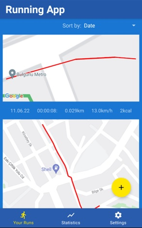

# RunningTracker
## Running Tracking App for Graduation

This is an application that you can track your runs with Google Maps.
You can see the statistics of all your runs.
You can see your front as live with rear camera while you are running.
Delete, sorting, cancelling, saving operations for runs.

### Includings

- CameraX
- Retrofit
- Coroutines
- Dagger Hilt
- Room Database
- MVVM Architecture
- Navigation
- LiveData
- Fragments
- DiffUtil RecyclerView
- Bar Chart

# Screenshot Samples

